# Teaching Guide — Raft + Istio URL Shortener

This document explains how this demo works, assuming minimal prior knowledge of distributed systems, Kubernetes, or service meshes.

## Table of Contents

1. [What This Demo Teaches](#what-this-demo-teaches)
2. [The Big Picture](#the-big-picture)
3. [Kubernetes Basics](#kubernetes-basics)
4. [Raft Consensus](#raft-consensus)
5. [Short Code Encoding](#short-code-encoding)
6. [What is a Service Mesh?](#what-is-a-service-mesh)
7. [Istio Architecture](#istio-architecture)
8. [Sidecar Injection](#sidecar-injection)
9. [Traffic Flow Through the Mesh](#traffic-flow-through-the-mesh)
10. [Istio Configuration Resources](#istio-configuration-resources)
11. [The Complete Request Journey](#the-complete-request-journey)
12. [gRPC and Transcoding](#grpc-and-transcoding)
13. [The Admin UI](#the-admin-ui)
14. [Observability](#observability)
15. [Load Testing](#load-testing)

---

## What This Demo Teaches

| Concept | What You'll See |
|---------|-----------------|
| Raft consensus | Leader election, log replication, snapshots |
| StatefulSet | Stable pod names, per-pod storage |
| Service mesh | Sidecar proxies, traffic interception |
| Istio routing | Label-based subsets, method-based routing |
| gRPC transcoding | JSON → protobuf at the gateway |
| Observability | Distributed traces, metrics |

---

## The Big Picture

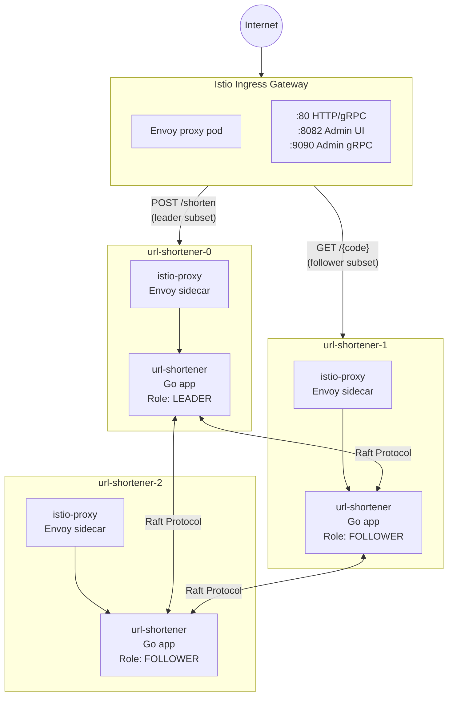

**The key insight**: Every pod has TWO containers — your app and an Envoy sidecar. All traffic flows through the sidecar, which enforces routing rules, collects metrics, and handles retries.

---

## Kubernetes Basics

### Why StatefulSet instead of Deployment?

A **Deployment** creates pods with random names (`app-7f8b9-xyz`). A **StatefulSet** creates pods with predictable names (`url-shortener-0`, `url-shortener-1`).

This matters because:
- Pod-0 knows it should bootstrap a new cluster
- Pod-1 and Pod-2 know they should join an existing cluster
- Each pod gets its own persistent storage that survives restarts

See: [`helm/url-shortener/templates/statefulset.yaml`](helm/url-shortener/templates/statefulset.yaml)

### The Headless Service

A normal Kubernetes Service load-balances across pods. A **headless service** (`ClusterIP: None`) doesn't — it just provides DNS names for each pod:

```
url-shortener-0.urlshortener-headless.url-shortener.svc.cluster.local
url-shortener-1.urlshortener-headless.url-shortener.svc.cluster.local
```

Raft nodes use these DNS names to find each other.

See: [`helm/url-shortener/templates/services.yaml`](helm/url-shortener/templates/services.yaml)

---

## Raft Consensus

Raft is a protocol for keeping multiple copies of data in sync. One node is the **leader** — it handles all writes. The others are **followers** — they replicate whatever the leader does.

### How It Works Here

1. **Pod-0 starts first** — it bootstraps a single-node cluster and becomes leader
2. **Pod-1 starts** — it calls the leader's `JoinCluster` RPC to be added as a voter
3. **Pod-2 starts** — same process
4. **A write comes in** — the leader writes to its log, replicates to followers, waits for a majority (2 of 3) to acknowledge, then commits

See: [`internal/raftcluster/cluster.go`](internal/raftcluster/cluster.go)

### The FSM (Finite State Machine)

The FSM is the bridge between Raft and your application state. Every committed log entry is passed to `FSM.Apply()`. The FSM must be **deterministic** — the same input must produce the same output on every node.

Our FSM writes to SQLite:

| Command | What it does |
|---------|--------------|
| `CmdShortenURL` | INSERT a new short code |
| `CmdReserveBlock` | Reserve a range of counter values |
| `CmdRecordFollow` | Update follow statistics |
| `CmdDeleteURL` | DELETE a URL |

See: [`internal/raftcluster/fsm.go`](internal/raftcluster/fsm.go) and [`internal/raftcluster/commands.go`](internal/raftcluster/commands.go)

### Counter Block Reservation

Creating a short URL requires a unique counter value. Committing each counter increment through Raft would be slow (network round-trip for every URL).

Instead, the leader **reserves a block** of 100 counter values at once. It can then hand them out from memory without any Raft overhead.

When leadership changes, the new leader reserves a fresh block. This may skip some counter values, but that's fine — uniqueness is what matters.

See the `reserveBlockIfNeeded` function in [`internal/raftcluster/cluster.go`](internal/raftcluster/cluster.go)

### Peer Discovery

The leader periodically checks Kubernetes **EndpointSlices** to see which pods exist:
- New pod appeared → call `raft.AddVoter()`
- Pod disappeared → call `raft.RemoveServer()`

This happens in `peerReconcileLoop`.

The RBAC rules grant permission to read EndpointSlices and patch pod labels:

See: [`helm/url-shortener/templates/rbac.yaml`](helm/url-shortener/templates/rbac.yaml)

---

## Short Code Encoding

A short code like `x7Kp2mNq` is derived from a counter integer. The encoding is designed to look random while being reversible (with the secret key).

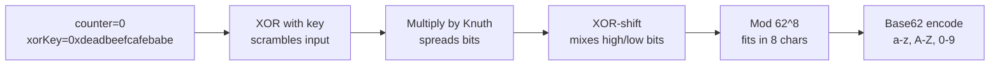

Adjacent counter values (`100`, `101`, `102`) produce codes with no visible relationship.

See: [`internal/shortcode/encode.go`](internal/shortcode/encode.go)

---

## What is a Service Mesh?

### The Problem

In a microservices architecture, you have many services talking to each other. Each service needs to handle:
- **Service discovery**: How do I find the other service?
- **Load balancing**: Which instance should I talk to?
- **Retries**: What if the call fails?
- **Timeouts**: How long should I wait?
- **Circuit breaking**: What if the service is overwhelmed?
- **Observability**: How do I trace requests across services?
- **Security**: How do I encrypt traffic? Authenticate callers?

You could implement all of this in every service. But that's a lot of duplicated code, and it's hard to keep consistent.

### The Solution: A Sidecar Proxy

A **service mesh** moves all this logic out of your application and into a **sidecar proxy** that runs alongside each service:

**Without Service Mesh:**

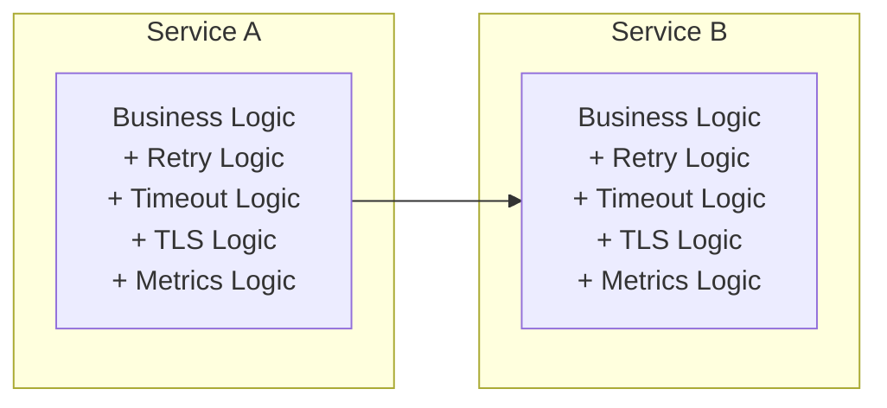

**With Service Mesh:**

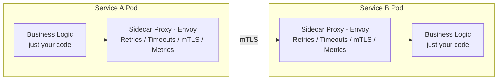

Your application just makes a plain HTTP call. The sidecar handles everything else.

### Why Envoy?

**Envoy** is a high-performance proxy originally built by Lyft. It's designed for service mesh use cases:
- **Hot reload**: Configuration changes without restart
- **Extensive metrics**: Latency histograms, success rates, etc.
- **Pluggable filters**: Add custom behavior (like gRPC transcoding)
- **HTTP/2 and gRPC native**: First-class support

Istio uses Envoy as its data plane proxy.

---

## Istio Architecture

Istio has two main components:

### Control Plane: istiod

**istiod** is a single binary that runs in the `istio-system` namespace. It:
- Watches Kubernetes for changes (pods, services, Istio config)
- Computes the routing rules for each sidecar
- Pushes configuration to all sidecars via xDS (Envoy's discovery protocol)
- Issues and rotates TLS certificates for mTLS

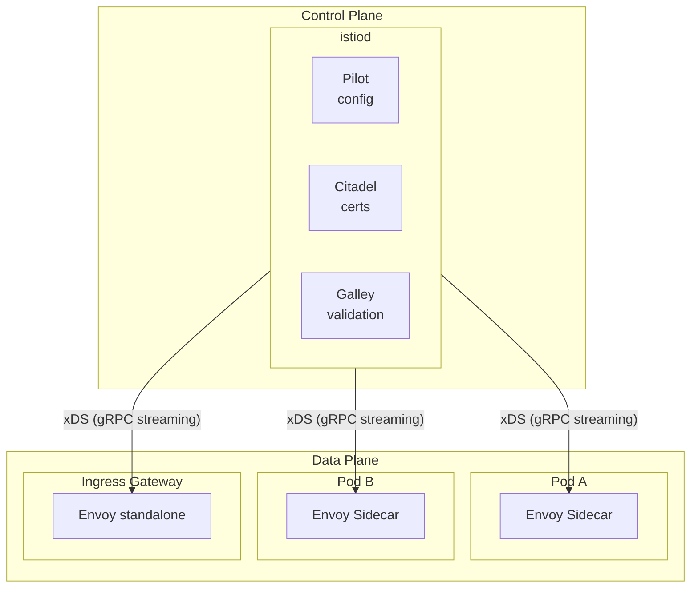

### Data Plane: Envoy Sidecars

The **data plane** is all the Envoy proxies running alongside your applications:
- **Sidecar proxies**: Injected into each pod
- **Ingress gateway**: Handles traffic entering the mesh from outside
- **Egress gateway**: (optional) Handles traffic leaving the mesh

Every Envoy maintains a gRPC connection to istiod. When configuration changes (new pod, new routing rule), istiod pushes updates to all relevant Envoys within seconds.

---

## Sidecar Injection

### How Does the Sidecar Get Into My Pod?

When you create a pod in a namespace with the label `istio-injection: enabled`, Istio's **mutating admission webhook** intercepts the pod creation and modifies the pod spec to add:

1. **The sidecar container**: `istio-proxy` (Envoy)
2. **An init container**: `istio-init` (sets up iptables)

```yaml
# What you submit:
spec:
  containers:
    - name: my-app
      image: my-app:latest

# What actually gets created:
spec:
  initContainers:
    - name: istio-init          # Sets up iptables rules
      image: istio/proxyv2
      securityContext:
        capabilities:
          add: [NET_ADMIN]
  containers:
    - name: my-app              # Your application
      image: my-app:latest
    - name: istio-proxy         # The Envoy sidecar
      image: istio/proxyv2
      ports:
        - containerPort: 15090  # Prometheus metrics
        - containerPort: 15021  # Health check
```

### The iptables Magic

The init container (`istio-init`) sets up iptables rules that redirect all network traffic through the sidecar:

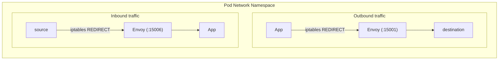

The iptables rules are set up like this (simplified):

```bash
# Redirect all outbound TCP traffic to Envoy's outbound port
iptables -t nat -A OUTPUT -p tcp -j REDIRECT --to-port 15001

# Redirect all inbound TCP traffic to Envoy's inbound port
iptables -t nat -A PREROUTING -p tcp -j REDIRECT --to-port 15006
```

Your application doesn't know this is happening. It just makes normal network calls. The kernel intercepts them and sends them to Envoy first.

### Verifying Sidecar Injection

Run `make verify-sidecars` to see that each pod has 2/2 containers ready:

```bash
$ kubectl get pods -n url-shortener
NAME                READY   STATUS    RESTARTS
url-shortener-0     2/2     Running   0          # app + istio-proxy
url-shortener-1     2/2     Running   0
url-shortener-2     2/2     Running   0
```

If you see `1/1`, sidecars aren't being injected. Check that the namespace has the label:

```bash
kubectl get namespace url-shortener --show-labels
# Should include: istio-injection=enabled
```

---

## Traffic Flow Through the Mesh

### Ingress Traffic (External → Mesh)

Traffic from outside the cluster enters through the **Ingress Gateway**:

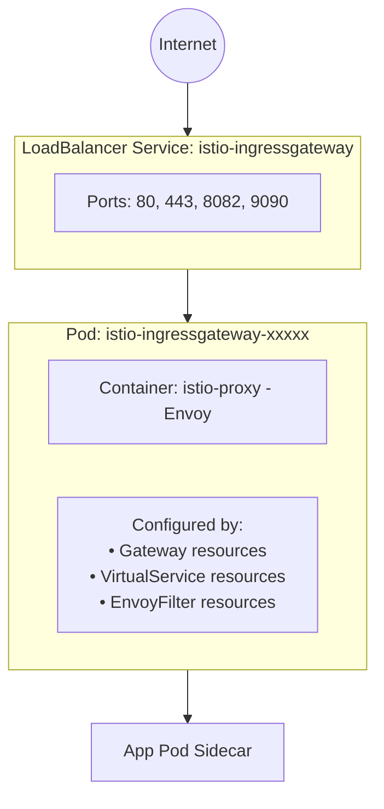

The ingress gateway is just an Envoy proxy with no application container. It's the entry point to the mesh.

See: [`istio/gateway-public.yaml`](istio/gateway-public.yaml) and [`istio/gateway-admin.yaml`](istio/gateway-admin.yaml)

### Mesh Traffic (Pod → Pod)

Traffic between pods within the mesh goes through both sidecars:

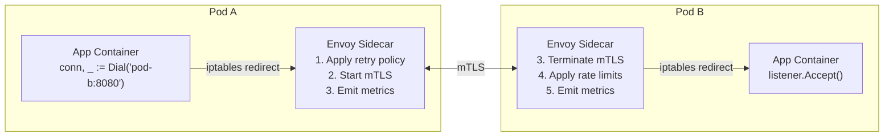

Both sidecars participate:
- **Outbound sidecar**: Applies client-side policies (retries, timeouts, load balancing)
- **Inbound sidecar**: Applies server-side policies (rate limits, authorization)
- **Both**: Participate in mTLS, emit metrics and traces

### The `mesh` Gateway

VirtualServices can target two types of gateways:
- **Named gateways** (e.g., `url-shortener-gateway`): For ingress traffic
- **`mesh`**: A special keyword meaning "all sidecars in the mesh"

```yaml
# This VirtualService applies to traffic entering the cluster
spec:
  gateways: [url-shortener-gateway]  # Ingress gateway only

# This VirtualService applies to pod-to-pod traffic
spec:
  gateways: [mesh]  # All sidecars

# This applies to both
spec:
  gateways: [url-shortener-gateway, mesh]
```

In this demo, we have separate VirtualServices for ingress and mesh traffic:
- [`istio/virtual-services/shortener-public-vs.yaml`](istio/virtual-services/shortener-public-vs.yaml) — ingress + mesh for public API

---

## Istio Configuration Resources

Istio adds several Custom Resource Definitions (CRDs) to Kubernetes. Here's how they work together:

### Gateway

A **Gateway** configures the ingress gateway's listeners — which ports to open and what protocols to expect:

```yaml
apiVersion: networking.istio.io/v1beta1
kind: Gateway
metadata:
  name: url-shortener-gateway
spec:
  selector:
    istio: ingressgateway        # Which Envoy to configure
  servers:
    - port:
        number: 80
        name: http
        protocol: HTTP
      hosts: ["*"]               # Accept any hostname
```

This tells the ingress gateway: "Listen on port 80 for HTTP traffic."

See: [`istio/gateway-public.yaml`](istio/gateway-public.yaml)

### VirtualService

A **VirtualService** defines routing rules — how to direct traffic based on the request:

```yaml
apiVersion: networking.istio.io/v1beta1
kind: VirtualService
metadata:
  name: url-shortener-ingress
spec:
  hosts: ["*"]
  gateways: [url-shortener-gateway]  # Apply to ingress traffic
  http:
    - name: shorten-write
      match:
        - method: { exact: POST }    # Match POST requests
          uri: { exact: /shorten }   # to /shorten
      route:
        - destination:
            host: url-shortener      # Route to this K8s Service
            subset: leader           # Specifically the "leader" subset
            port: { number: 9092 }   # On this port
      retries:
        attempts: 3
        perTryTimeout: 4s
        retryOn: 5xx,connect-failure,reset
```

**Key fields**:
- `hosts`: Which hostnames this rule applies to
- `gateways`: Which gateways (or `mesh`) this rule applies to
- `match`: Conditions that must be true
- `route`: Where to send matching traffic
- `retries`: Automatic retry policy

See: [`istio/virtual-services/shortener-public-vs.yaml`](istio/virtual-services/shortener-public-vs.yaml)

### DestinationRule

A **DestinationRule** defines policies for traffic TO a specific service:

```yaml
apiVersion: networking.istio.io/v1beta1
kind: DestinationRule
metadata:
  name: url-shortener
spec:
  host: url-shortener              # This rule applies to traffic going here
  trafficPolicy:
    connectionPool:
      http:
        http2MaxRequests: 200      # Max concurrent requests
        h2UpgradePolicy: UPGRADE   # Upgrade HTTP/1.1 to HTTP/2
    outlierDetection:
      consecutive5xxErrors: 5      # Eject after 5 consecutive 5xx errors
      interval: 10s                # Check every 10 seconds
      baseEjectionTime: 30s        # Eject for at least 30 seconds
  subsets:
    - name: leader
      labels:
        raft-role: leader          # Pods with this label
    - name: follower
      labels:
        raft-role: follower        # Pods with this label
```

**Subsets** are the key concept here. A subset is a named group of pods, selected by label. VirtualServices route to subsets, not individual pods.

**Outlier detection** is like a circuit breaker. If a pod returns too many errors, it's temporarily removed from the load balancing pool.

See: [`istio/destination-rules/shortener-dr.yaml`](istio/destination-rules/shortener-dr.yaml)

### EnvoyFilter

An **EnvoyFilter** lets you directly modify Envoy's configuration. This is a power-user feature for things Istio doesn't support natively.

We use it to add gRPC-JSON transcoding:

```yaml
apiVersion: networking.istio.io/v1alpha3
kind: EnvoyFilter
metadata:
  name: urlshortener-grpc-transcoder
  namespace: istio-system
spec:
  workloadSelector:
    labels:
      istio: ingressgateway        # Apply to the ingress gateway
  configPatches:
    - applyTo: HTTP_FILTER
      match:
        context: GATEWAY
        listener:
          portNumber: 80           # On the port 80 listener
      patch:
        operation: INSERT_BEFORE   # Add this filter before the router
        value:
          name: envoy.filters.http.grpc_json_transcoder
          typed_config:
            "@type": type.googleapis.com/envoy.extensions.filters.http.grpc_json_transcoder.v3.GrpcJsonTranscoder
            proto_descriptor_bin: <base64 encoded proto descriptor>
            services: [urlshortener.v1.URLShortenerService]
```

See: [`istio/envoy-filter-transcoder.yaml.tmpl`](istio/envoy-filter-transcoder.yaml.tmpl)

### How They Work Together

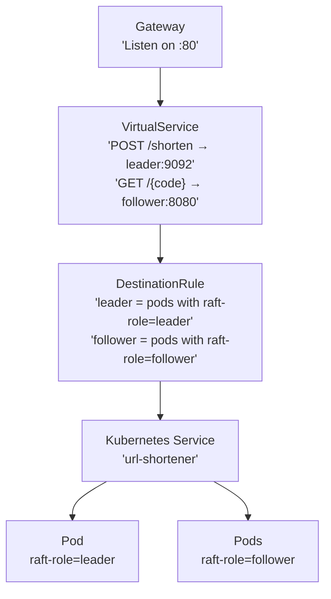

---

## The Complete Request Journey

Let's trace a `POST /shorten` request through the entire system:

### Step 1: Client → LoadBalancer

```
curl -X POST http://localhost:8080/shorten \
  -H "Content-Type: application/json" \
  -d '{"long_url":"https://example.com"}'
```

The request arrives at the Kubernetes LoadBalancer Service (`istio-ingressgateway`).

### Step 2: LoadBalancer → Ingress Gateway Pod

The LoadBalancer forwards to one of the ingress gateway pods. This is a standalone Envoy proxy.

### Step 3: Envoy Processes the Request

The ingress gateway Envoy:

1. **Receives on listener :80** (configured by Gateway resource)

2. **Runs HTTP filters** in order:
   - `grpc_json_transcoder`: Sees `POST /shorten`, converts JSON body to protobuf
   - `router`: Looks up route in VirtualService

3. **Matches VirtualService rule**:
   ```yaml
   match:
     - method: { exact: POST }
       uri: { exact: /shorten }
   route:
     - destination:
         host: url-shortener
         subset: leader
         port: { number: 9092 }
   ```

4. **Resolves subset**:
   - Looks up DestinationRule for `url-shortener`
   - Finds `subset: leader` = pods with label `raft-role: leader`
   - Gets current pod IPs from Kubernetes API (via istiod)

5. **Selects endpoint**:
   - Only one pod has `raft-role: leader`
   - That pod's IP is selected

6. **Initiates mTLS connection** to the target pod's sidecar

### Step 4: Ingress Gateway → Target Pod Sidecar

The request travels over the network to the target pod. It arrives at the **sidecar's inbound port** (15006).

### Step 5: Target Pod Sidecar Processing

The target pod's sidecar Envoy:

1. **Terminates mTLS**: Verifies the client certificate, decrypts traffic
2. **Applies inbound policies**: Rate limits, authorization (none in our case)
3. **Forwards to localhost**: Sends to the app container on port 9092

### Step 6: Application Handles Request

The Go application:

1. Receives gRPC `ShortenURL` request (transcoding already happened)
2. Reserves a counter value (via Raft if needed)
3. Generates short code
4. Applies `CmdShortenURL` through Raft (replicates to followers)
5. Returns `ShortenURLResponse`

### Step 7: Response Returns

The response travels back through the same path:
- App → sidecar → network (mTLS) → ingress gateway → client

The ingress gateway's `grpc_json_transcoder` filter converts the protobuf response back to JSON.

### Visualizing with Jaeger

You can see this entire flow in Jaeger (http://localhost:16686 after `make port-forward`):

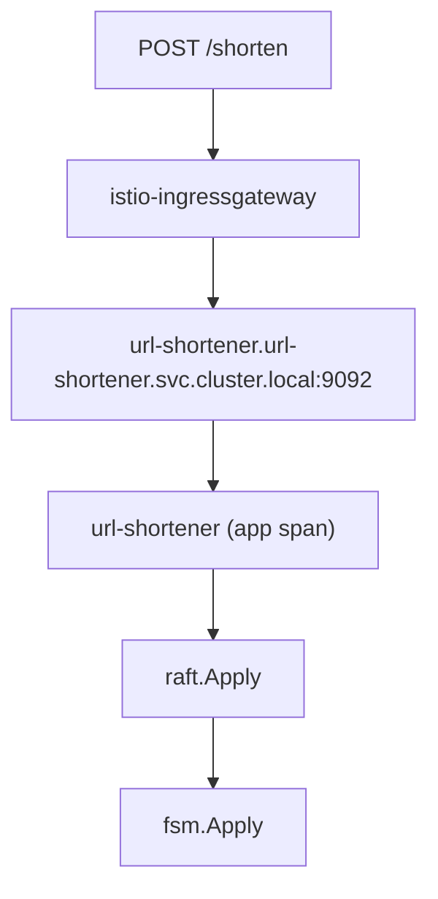

---

## Retry Policies and Timeouts

### How Retries Work

When Envoy gets a retryable error, it automatically retries:

```yaml
retries:
  attempts: 3              # Try up to 3 times total
  perTryTimeout: 4s        # Each attempt times out after 4s
  retryOn: 5xx,connect-failure,reset
```

**retryOn conditions**:
- `5xx`: HTTP 500-599 responses
- `connect-failure`: TCP connection failed
- `reset`: Connection was reset mid-request
- `retriable-4xx`: Specific 4xx errors (409 Conflict)
- `unavailable`: gRPC status UNAVAILABLE

### The Leader Election Window

During a leader election, the `leader` subset has zero endpoints (no pod has the label yet). Requests get 503 Service Unavailable.

The retry policy handles this:
1. Request arrives, no endpoints → 503
2. Envoy waits, retries
3. New leader patches its label
4. istiod pushes update to Envoy (~1-2 seconds)
5. Retry succeeds

With `attempts: 3` and `perTryTimeout: 4s`, we can survive elections up to ~12 seconds.

### Observing Retries

During a load test, trigger an election:

```bash
# Terminal 1
make loadtest-create

# Terminal 2
make trigger-election
```

You'll see brief 503 errors in the load test output, then they stop as retries succeed.

---

## Pod Labels and Dynamic Routing

### How Labels Drive Traffic

The magic of this demo is that **changing a pod label changes where traffic goes**.

**Before election:**

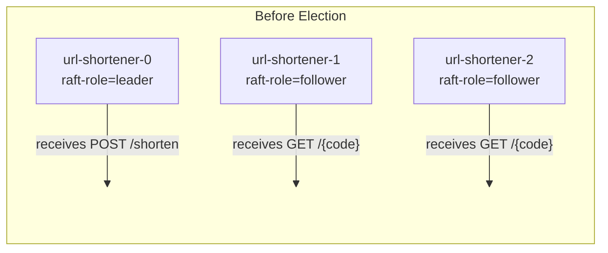

**After election:**

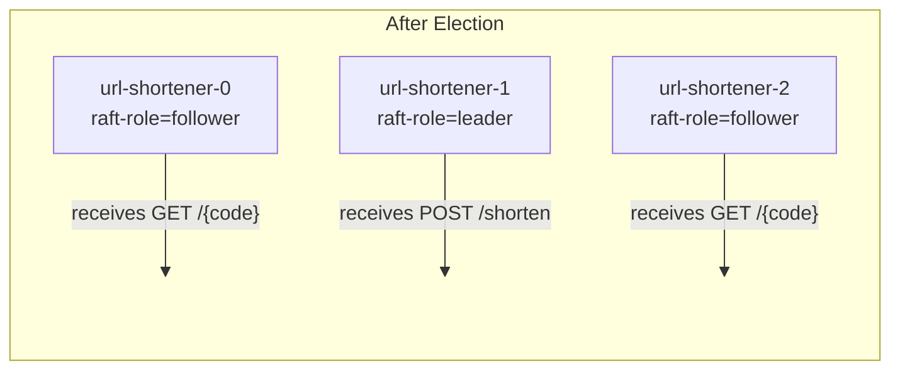

No VirtualService change. No DestinationRule change. Just a label change on the pod.

### How the Label Gets Updated

When Raft notifies the app that leadership changed:

```go
// internal/raftcluster/cluster.go
func (c *Cluster) updateRaftRoleLabel(ctx context.Context, isLeader bool) {
    role := "follower"
    if isLeader {
        role = "leader"
    }
    patch := fmt.Sprintf(`{"metadata":{"labels":{"raft-role":%q}}}`, role)
    c.k8sClient.CoreV1().Pods(namespace).Patch(ctx, podName, types.MergePatchType, []byte(patch), metav1.PatchOptions{})
}
```

### How Istio Sees the Change

1. App patches pod label via Kubernetes API
2. Kubernetes updates the pod object
3. istiod is watching pods (via Kubernetes informers)
4. istiod recomputes which pods belong to which subset
5. istiod pushes xDS update to all Envoys
6. Envoys update their endpoint lists

This happens in **1-3 seconds**. The retry policy covers the gap.

### The Single-Replica Problem

If you scale to 1 replica, the `follower` subset has zero endpoints. All `GET /{code}` requests fail with 503.

This is a limitation of the routing design, not a bug. The demo assumes at least 2 replicas.

---

## gRPC and Transcoding

### Why gRPC?

gRPC provides:
- Strongly-typed contracts (`.proto` files generate code)
- Efficient binary serialization (protobuf)
- HTTP/2 multiplexing
- Built-in streaming

### The Problem

Browsers and `curl` speak JSON over HTTP/1.1. Pods speak gRPC over HTTP/2.

### The Solution: Envoy Transcoding

An **EnvoyFilter** on the Istio gateway converts JSON to gRPC automatically:

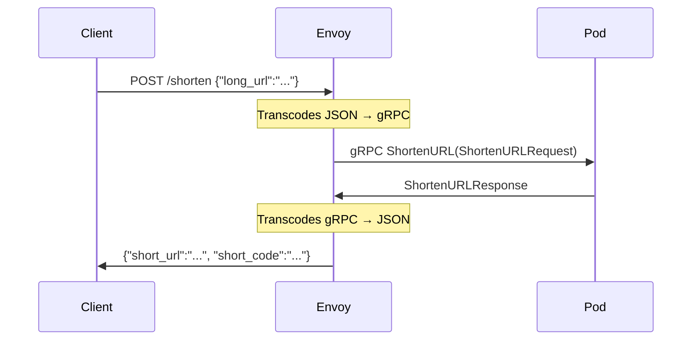

The filter uses a **proto descriptor** — a binary file containing all the type definitions. The `.proto` file declares HTTP bindings:

```protobuf
rpc ShortenURL(ShortenURLRequest) returns (ShortenURLResponse) {
  option (google.api.http) = {
    post: "/shorten"
    body: "*"
  };
}
```

See: [`proto/urlshortener/v1/urlshortener.proto`](proto/urlshortener/v1/urlshortener.proto) and [`istio/envoy-filter-transcoder.yaml.tmpl`](istio/envoy-filter-transcoder.yaml.tmpl)

### Generating the Descriptor

```bash
make generate
# Runs: buf build -o gen/descriptor/urlshortener.pb

make envoyfilter-apply
# Base64 encodes the descriptor and applies the EnvoyFilter
```

---

## The Admin UI

The admin interface has two parts:

1. **SvelteKit SPA** — static HTML/JS served by nginx
2. **Go JSON API** — translates HTTP/JSON to gRPC

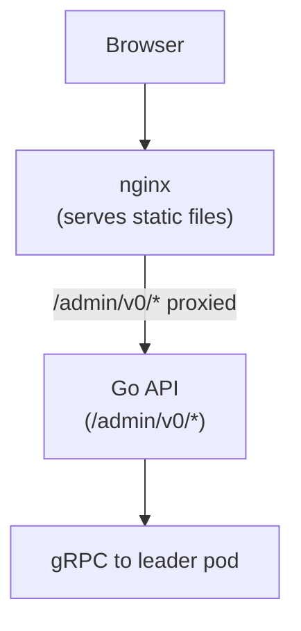

Both run in the same Docker image (different entrypoint). The nginx config proxies `/admin/v0/` requests to the Go API, avoiding CORS issues.

See: [`adminui/`](adminui/) for the SvelteKit app

### Admin gRPC Methods

```protobuf
service AdminService {
  rpc GetRaftState(...)        // Cluster status
  rpc TriggerElection(...)     // Force leadership transfer
  rpc ListURLsWithStats(...)   // Paginated URL list
  rpc DeleteURL(...)           // Remove a URL
  rpc JoinCluster(...)         // Called by new pods
  rpc RecordFollow(...)        // Track redirect stats
}
```

See: [`proto/admin/v1/admin.proto`](proto/admin/v1/admin.proto)

---

## Observability

### Tracing with Jaeger

Every request creates a **span**. Spans link together to show the full request path:

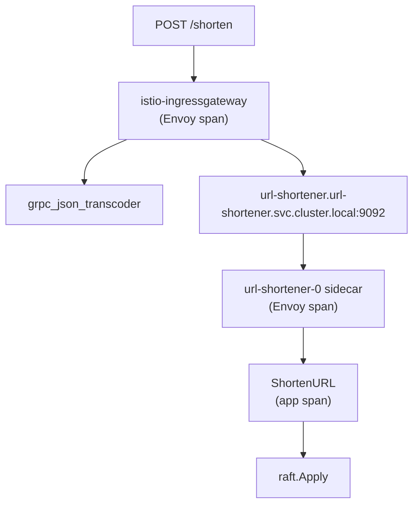

The app uses OpenTelemetry SDK to create spans. Istio sidecars add their own spans automatically.

See: [`pkg/tracing.go`](pkg/tracing.go)

### Metrics with Prometheus

The app exposes metrics at `/metrics` on port 8081:

- `urlshortener_shorten_total` — URLs created
- `urlshortener_resolve_total` — redirects served
- `urlshortener_raft_apply_total` — Raft commands applied

Istio also exposes metrics:
- `istio_requests_total` — Request count by source, destination, response code
- `istio_request_duration_milliseconds` — Latency histograms

See: [`pkg/metrics.go`](pkg/metrics.go)

### The OTEL Collector

The collector receives telemetry from apps and forwards it to backends:

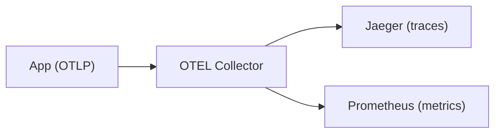

See: [`otel/collector.yaml`](otel/collector.yaml)

---

## Load Testing

Two `wrk` scripts test different traffic patterns:

### `loadtest-create` — Write Throughput

Continuously POSTs random URLs. Tests:
- Leader routing
- Raft commit latency
- Counter block reservation

### `loadtest-follow` — Read Throughput

First fetches all existing short codes from the admin API, then hammers `GET /{code}` requests. Tests:
- Follower routing
- SQLite read performance
- Redirect handling

The scripts use wrk's Lua API:
- `setup()` runs before workers start (fetch data, distribute to threads)
- `init()` runs once per worker thread
- `request()` builds each HTTP request
- `response()` handles responses

See: [`scripts/create.lua`](scripts/create.lua) and [`scripts/follow.lua`](scripts/follow.lua)

---

## Key Files Reference

| Path | Purpose |
|------|---------|
| [`internal/raftcluster/cluster.go`](internal/raftcluster/cluster.go) | Raft cluster setup, peer discovery, label patching |
| [`internal/raftcluster/fsm.go`](internal/raftcluster/fsm.go) | FSM implementation (Apply, Snapshot, Restore) |
| [`internal/raftcluster/commands.go`](internal/raftcluster/commands.go) | Command types and serialization |
| [`internal/shortcode/encode.go`](internal/shortcode/encode.go) | Counter → short code encoding |
| [`internal/service/shortener.go`](internal/service/shortener.go) | HTTP handlers (redirect) |
| [`internal/service/urlshortener_grpc.go`](internal/service/urlshortener_grpc.go) | gRPC service implementation |
| [`internal/service/admin.go`](internal/service/admin.go) | Admin gRPC service |
| [`internal/db/`](internal/db/) | SQLite setup, migrations, queries |
| [`proto/urlshortener/v1/urlshortener.proto`](proto/urlshortener/v1/urlshortener.proto) | Public gRPC API |
| [`proto/admin/v1/admin.proto`](proto/admin/v1/admin.proto) | Admin gRPC API |
| [`helm/url-shortener/templates/statefulset.yaml`](helm/url-shortener/templates/statefulset.yaml) | Kubernetes StatefulSet |
| [`istio/gateway-public.yaml`](istio/gateway-public.yaml) | Ingress gateway listener config |
| [`istio/gateway-admin.yaml`](istio/gateway-admin.yaml) | Admin gateway listener config |
| [`istio/virtual-services/shortener-public-vs.yaml`](istio/virtual-services/shortener-public-vs.yaml) | Public API routing rules |
| [`istio/virtual-services/admin-vs.yaml`](istio/virtual-services/admin-vs.yaml) | Admin gRPC routing |
| [`istio/virtual-services/adminui-vs.yaml`](istio/virtual-services/adminui-vs.yaml) | Admin UI routing |
| [`istio/destination-rules/shortener-dr.yaml`](istio/destination-rules/shortener-dr.yaml) | Leader/follower subsets |
| [`istio/envoy-filter-transcoder.yaml.tmpl`](istio/envoy-filter-transcoder.yaml.tmpl) | gRPC-JSON transcoding |

---

## Demo Scenarios

### Trigger a Leader Election

```bash
make trigger-election
make pods  # Watch the raft-role labels change
```

### Scale the Cluster

```bash
make scale-up    # 3 → 5 pods
make pods        # See new followers join
make scale-down  # Back to 3
```

### Watch Raft Replication

1. Open the Admin UI (http://localhost:8082)
2. Create a URL via `curl -X POST ...`
3. Watch the URL appear in the list (replicated to the follower you're viewing)

### Test Failure Recovery

1. Run `make loadtest-create` in one terminal
2. Run `make trigger-election` in another
3. Watch the load test handle 503s during election (retry policy absorbs them)

### Inspect Envoy Config

```bash
# See what routes the ingress gateway has
istioctl proxy-config routes deployment/istio-ingressgateway -n istio-system

# See what clusters (upstreams) a pod's sidecar knows about
istioctl proxy-config clusters url-shortener-0 -n url-shortener

# See the full Envoy config
istioctl proxy-config all url-shortener-0 -n url-shortener -o json
```
